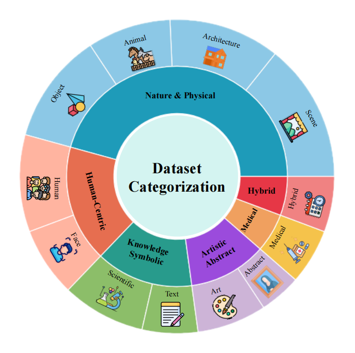
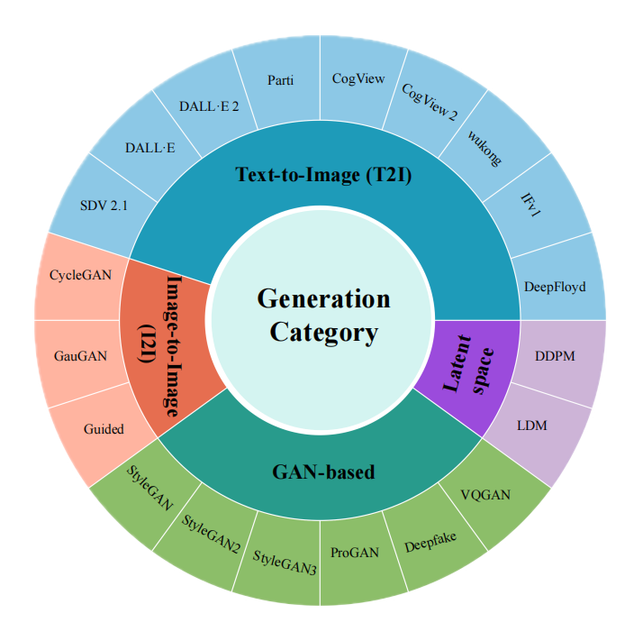
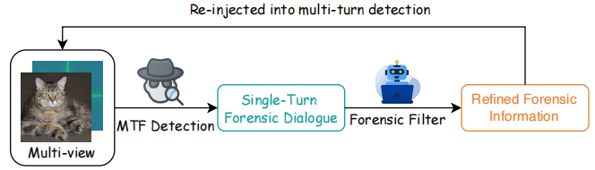

# MTF-Bench: A Multi-Turn Forensic Benchmark for Explainable AI-Generated Image Detection
# MTF-Bench

This repository is the official implementation of the **MTF-Bench benchmark**. It contains the MTF-Bench dataset, construction pipeline, and evaluated methods for multi-turn forensic reasoning on image authenticity.

If you find this project useful, please consider **forking**, **watching**, and giving a ⭐ **star** to support our work.  
We also encourage you to visit our project homepage for more details.

---

## 📌 Overview

**MTF-Bench** is the first benchmark designed for **multi-turn, multi-perspective synthetic image detection**.  
Unlike traditional single-step classification benchmarks, MTF-Bench introduces structured multi-round dialogue reasoning to better evaluate model capabilities in image forensics.

---
---
## 📊 Dataset Visualization

### 📈 Data Distribution

The dataset is systematically organized across diverse content categories and generator types, ensuring broad coverage and strong generalization.

  
    

  <em>(a) Content Distribution &nbsp;&nbsp;&nbsp; (b) Generator Distribution</em>

  <em>Figure 1: Distribution of MTF-Bench across different dimensions.</em>

---

### 🏗️ Dataset Construction Pipeline

MTF-Bench is built through a two-stage pipeline including data preparation and multi-turn dialogue generation with quality control.

  

  <em>Figure 2: Overview of the MTF-Bench construction pipeline.</em>

---

### 🔍 Detection Pipeline

We design a multi-turn forensic reasoning framework that progressively analyzes images from multiple complementary perspectives.

  

  <em>Figure 3: Multi-turn detection pipeline of MTF-Bench.</em>

---

## 🚀 Key Features

- **🧠 Multi-Turn Reasoning Paradigm**  
  Each sample consists of structured multi-round dialogues, enabling step-by-step forensic analysis rather than single-shot prediction.

- **🔍 Diverse Forensic Perspectives**  
  Covers multiple complementary detection dimensions, including:
  - Visual artifacts
  - Physical consistency
  - Semantic plausibility
  - Frequency-domain patterns
  - Multimodal reasoning

- **✅ High-Quality Annotations**  
  Dialogue turns are filtered through confidence-based scoring and additional manual verification to ensure reliability.

- **🌐 Rich Content Diversity**  
  Includes a wide range of image categories such as:
  - Human / Face
  - Object / Scene
  - Art / Abstract
  - Medical / Scientific
  - Image-Text / Hybrid

- **⚙️ Model-Agnostic Benchmarking**  
  Supports evaluation of:
  - Vision-Language Models (VLMs)
  - Pure Vision Models  
  under a unified multi-turn reasoning framework.

---

## 📊 Dataset Highlights

- Multi-turn dialogue-based annotations
- Fine-grained forensic reasoning steps
- Broad category coverage with strong generalization ability
- Carefully curated and filtered high-quality samples

---

